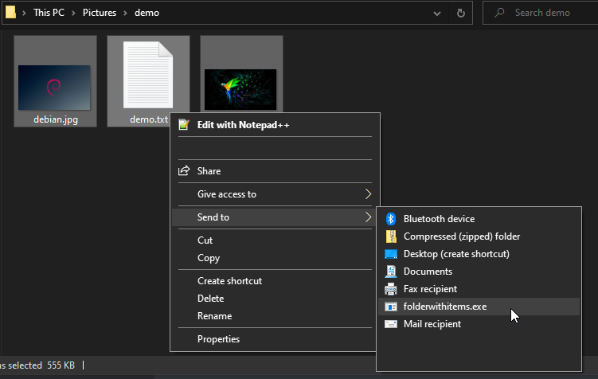
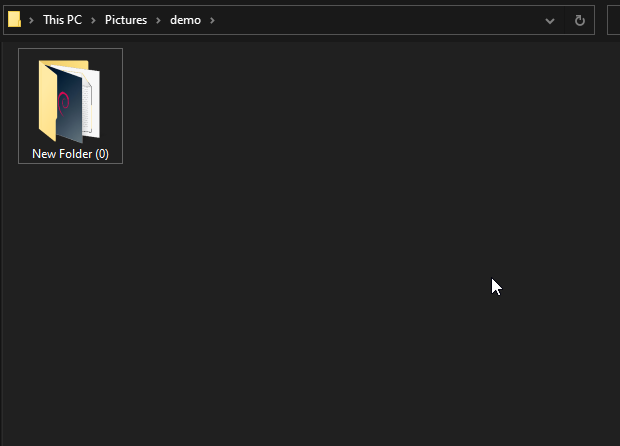

# New Folder with Selected Items
 A rust implementation of the macOS function. If folder already exists in directory, will increment the number until one does not exists.

```rust
rust build --release
```

Copy compiled exe to `%AppData%\Roaming\Microsoft\Windows\SendTo`




